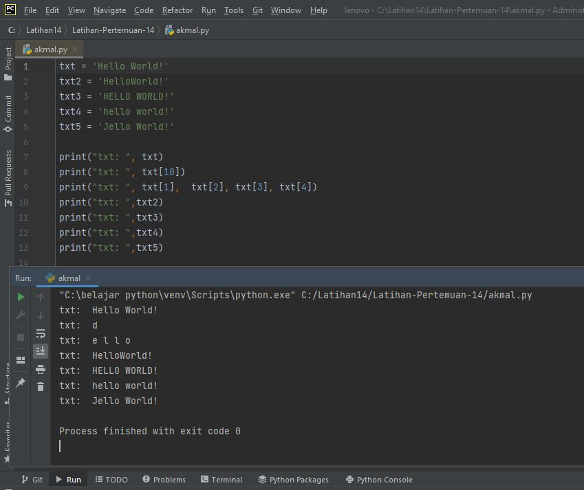

# Latihan-Pertemuan-14
## M. AKMAL AL ABDILAH(312110034)

1. LATIHAN PERTEMUAN 14'
'
    txt = 'Hello World'

    • Hitung jumlah karakternya
    • Ambil karakter terakhir
    • Ambil karakter index ke-2 sampai index ke-4 (llo)
    • Hilangkan spasi pada text tersebut (HelloWorld)
    • Ubah text menjadi huruf besar
    • Ubah text menjadi huruf kecil
    • Ganti karakter H dengan karakter J'
'

Hasil Codingan'
'
1.  txt = 'Hello World!'
    txt2 = 'HelloWorld!'
    txt3 = 'HELLO WORLD!'
    txt4 = 'hello world!'
    txt5 = 'Jello World!'

    print("txt: ", txt)
    print("txt: ", txt[10])
    print("txt: ", txt[1],  txt[2], txt[3], txt[4])
    print("txt: ",txt2)
    print("txt: ",txt3)
    print("txt: ",txt4)
    print("txt: ",txt5)'
'

Hasil Ouput Coding Diatas'
'

